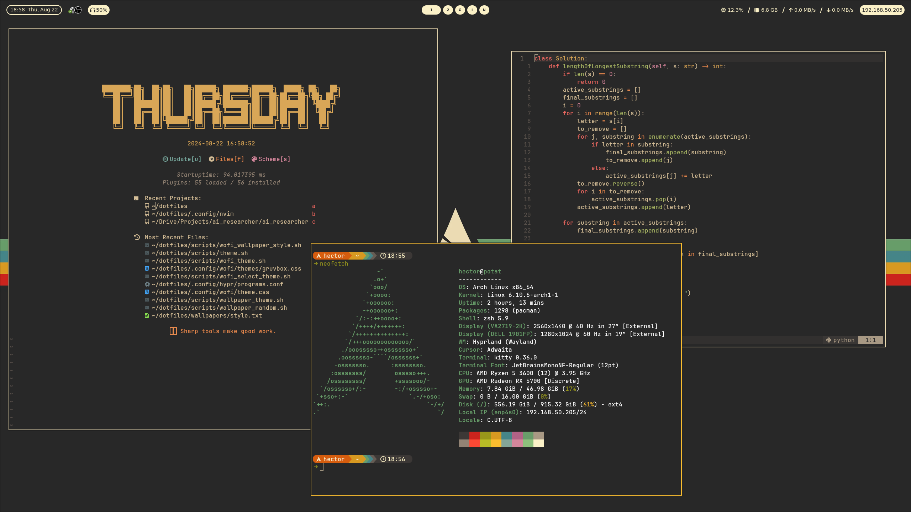
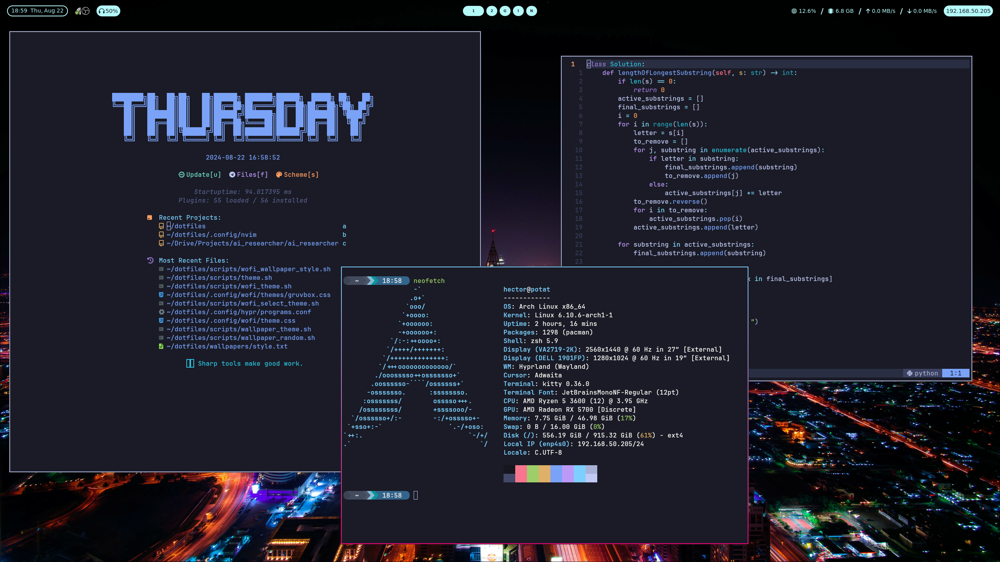
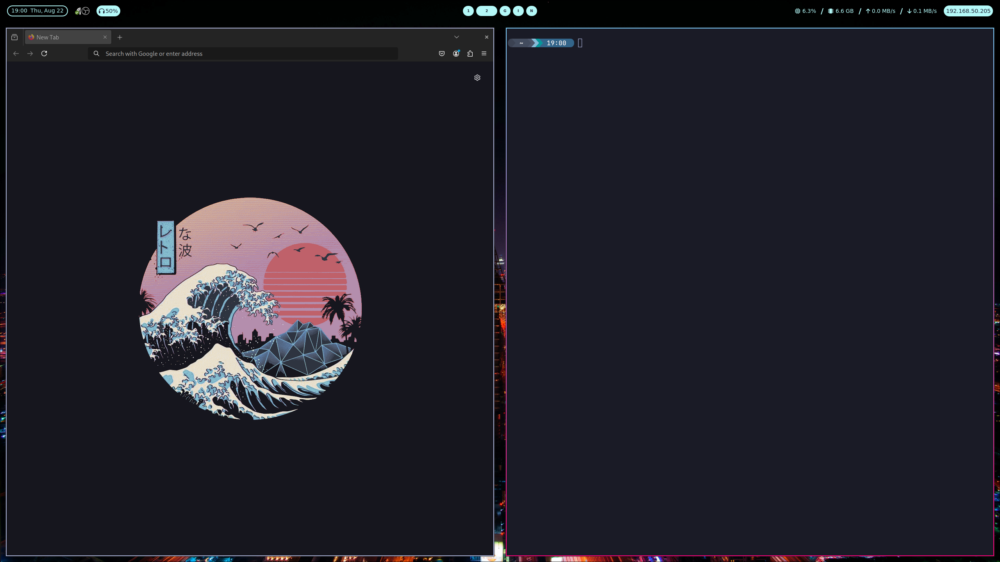

# My Dotfiles
## Installation
Only works with Arch, if you wish to use my Dotfiles on another distro you can still use the configs but not the installation.

Run the installation script in the installation directory, you need to switch out the github script to use your credentials (or just remove it). 
It probably won't completly work but who knows.

It installs a lot of packages, some of which are nessecary and some that are just nice to have.

I use stow to manage the dotfiles so in theory you should just be able to do stow . in the dotfiles directory and it should put the configs in the right places but you may have to move your own configs first.

## Screenshots




## Theme switcher
Doing SUPER + , opens the theme switcher, it currently has 4 themes (perhaps more if i haven't updated this text). It is integrated with:
- kitty
- swww (wallpaper app)
- hyprland (borders and stuff)
- waybar
- tmux
- neovim
- firefox (changes the background in new tabs)
- starship

All the theme switcher scripts can be found in the scripts directory, it's a little messy but most of the scripts are simple and just modify some config file.
You need to start neovim with --listen themelistener each time if you want active sessions to switch automatically. You can do that like this:

```bash
nvim_random_listen() {
    local random_number=$(od -An -N2 -i /dev/random | tr -d ' ')
    local server_name="/tmp/themelistener${random_number}"
    nvim --listen "$server_name" "$@"
}

# Alias the nvim command to use the function
alias nvim="nvim_random_listen"
```

### Background switcher
You can also switch background style with SUPER + . (dot).

It checks what folders exists in the theme background folder, for example dotfiles/tokyo-night/real and lets you choose between them.

To get a new background of the same style use SUPER + -

## Controls
Move around with SUPER + hjkl or SUPER + arrow keys.

Move workspace with SUPER + 1-9 or SUPER + one of many letters to enter a programs workspace,

for example SUPER + n will allways to to a terminal and SUPER + i to Google Chrome

You can see the rest in the hyprland config
