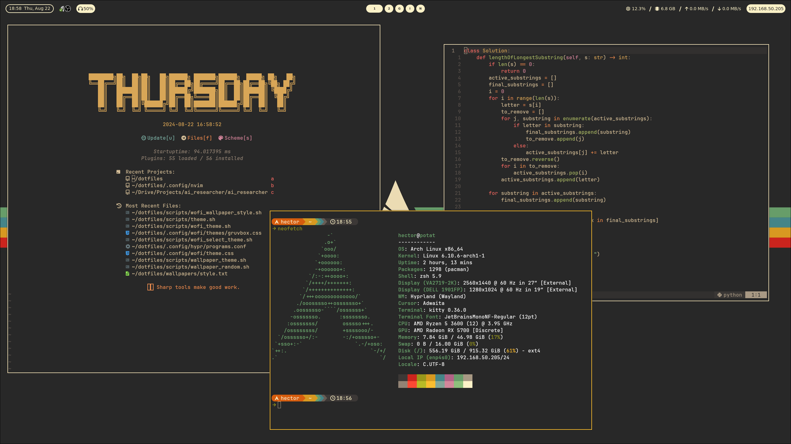
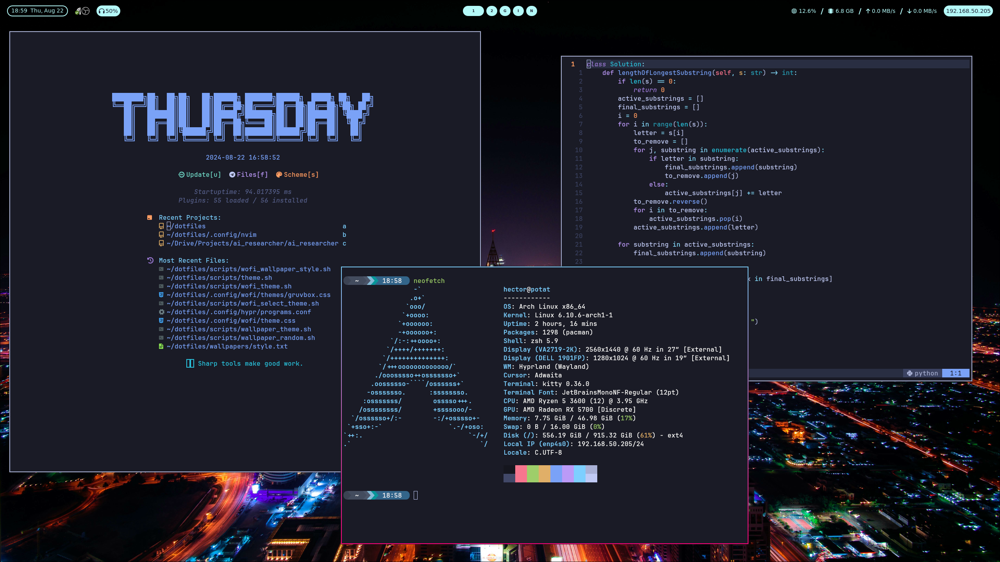
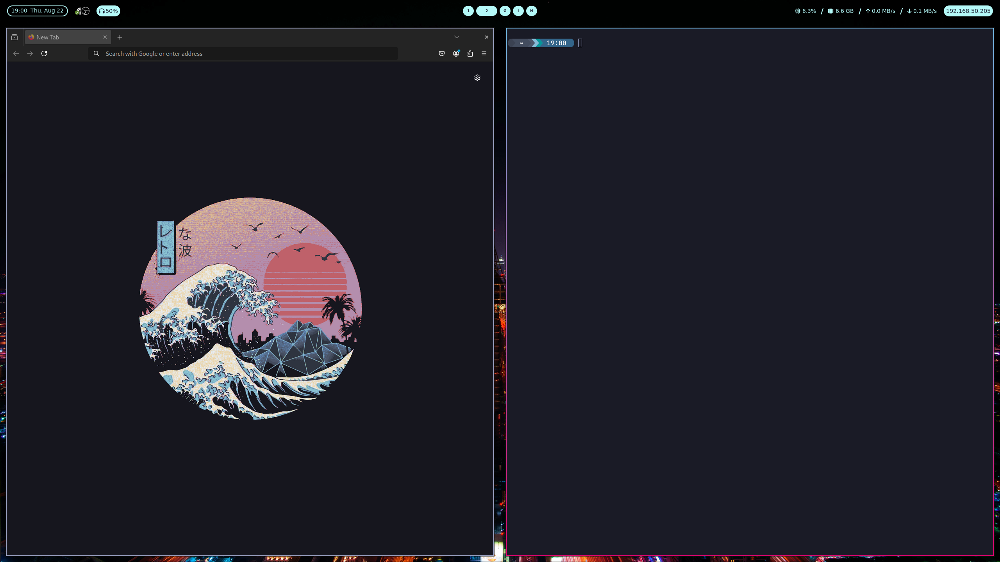

# My Dotfiles
## Installation
Provisioned with **Ansible**. Works on Arch today (Debian/Fedora scaffolding is in place but unverified). NixOS machines keep using the flake in `nixos/` — Ansible is only for non-NixOS boxes.

There are two profiles:
- **wsl** — CLI/dev tooling only (zsh, tmux, nvim, cargo, uv, dotnet, fnm…)
- **desktop** — everything above plus the full Wayland/Hyprland GUI stack

### Fresh machine
```bash
git clone --recurse-submodules https://github.com/HectorBjernersjo/dotfiles ~/dotfiles
~/dotfiles/ansible/bootstrap.sh            # auto-detects wsl vs desktop
```
`bootstrap.sh` installs git + ansible, syncs submodules, installs the required
Galaxy collections, then runs the playbook. Force a profile with
`bootstrap.sh desktop`, or pass through args like
`bootstrap.sh wsl -- --tags dotfiles` for a fast partial run.

### Re-running / partial runs
```bash
cd ~/dotfiles/ansible
ansible-playbook -i inventory/wsl.yml site.yml --ask-become-pass            # full
ansible-playbook -i inventory/wsl.yml site.yml --ask-become-pass --tags dotfiles
```
The playbook is idempotent — re-running only changes what drifted.

### GitHub auth & projects
Auth to GitHub is HTTPS via the `gh` credential helper (already wired in
`.gitconfig`). Run `gh auth login` once per machine and pushes work — no SSH key
to manage. The `projects` role then clones my personal repos (see the `projects`
list in `ansible/group_vars/all.yml`); private repos clone fine because `gh` is
authenticated. Add a repo by appending `{ repo, dest }` to that list.

Dotfiles are symlinked into place by the `dotfiles` role (no more `stow`). Any
pre-existing real file at a link target is moved aside to `<file>.dotfiles-bak`
before the symlink is created.

## Layout
- `ansible/` — provisioning (see above)
- `nixos/` — flake for the NixOS machines
- `.config/`, `.zshrc`, `.gitconfig`, `.ssh/` — the actual dotfiles, symlinked by the `dotfiles` role
- `bin/` — scripts on PATH (`bin/work/` holds work-specific ones)
- `theme/` — the theme switcher and everything it touches (including the firefox chrome)
- `wallpapers/` — wallpapers, organized per theme
- `windows/` — AutoHotkey/GlazeWM config for the Windows host
- `docs/` — README assets

## Screenshots




## Theme switcher
Doing SUPER + , opens the theme switcher, it currently has 4 themes (perhaps more if i haven't updated this text). It is integrated with:
- kitty
- swww (wallpaper app)
- hyprland (borders and stuff)
- waybar
- tmux
- neovim
- firefox (changes the background in new tabs)
- starship

All the theme switcher scripts can be found in the `theme/` directory, most of the scripts are simple and just modify some config file.
You need to start neovim with --listen themelistener each time if you want active sessions to switch automatically. You can do that like this:

```bash
nvim_random_listen() {
    local random_number=$(od -An -N2 -i /dev/random | tr -d ' ')
    local server_name="/tmp/themelistener${random_number}"
    nvim --listen "$server_name" "$@"
}

# Alias the nvim command to use the function
alias nvim="nvim_random_listen"
```

### Background switcher
You can also switch background style with SUPER + . (dot).

It checks what folders exists in the theme background folder, for example dotfiles/tokyo-night/real and lets you choose between them.

To get a new background of the same style use SUPER + -

## Controls
Move around with SUPER + hjkl or SUPER + arrow keys.

Move workspace with SUPER + 1-9 or SUPER + one of many letters to enter a programs workspace,

for example SUPER + n will allways to to a terminal and SUPER + i to Google Chrome

You can see the rest in the hyprland config
